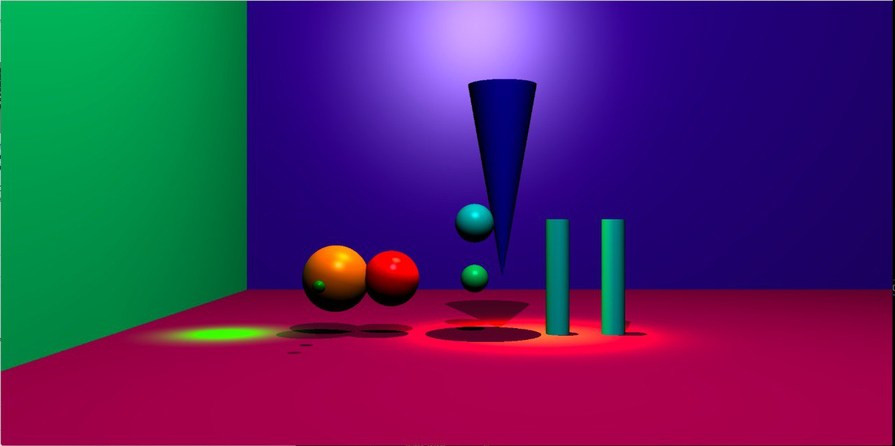
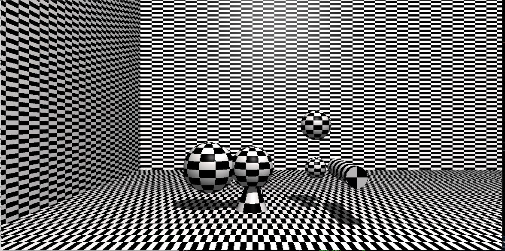
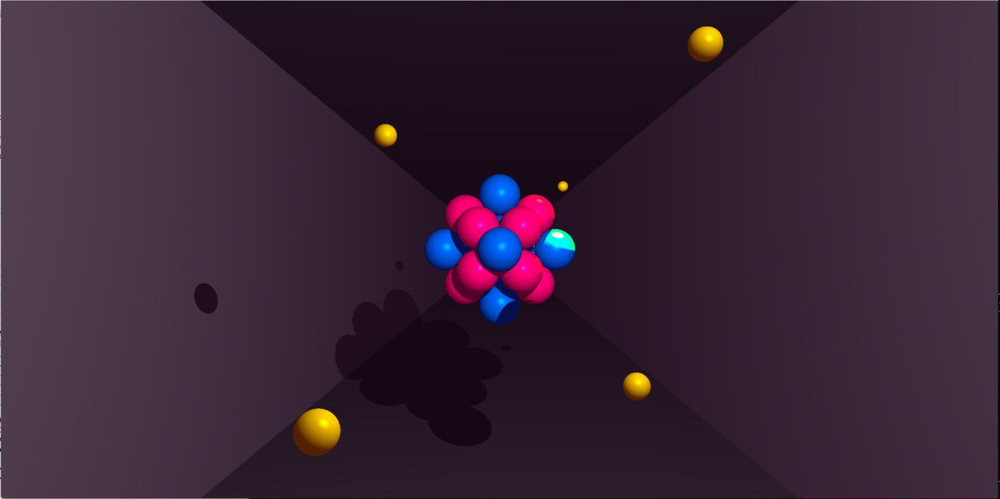
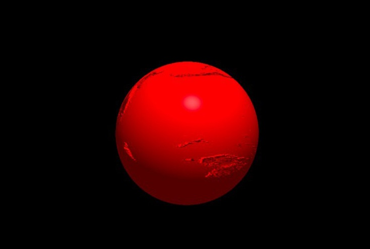

# miniRT

A 3D ray tracer implemented in C using the MiniLibX graphics library. This project creates photorealistic images by simulating light rays interacting with 3D objects.

*Part of the 42 School curriculum*

## Gallery

### Mandatory Features

*Basic ray tracing with spheres, planes, cylinders, cones, and lighting*

### Checkerboard Patterns

*Procedural texturing with configurable checkerboard patterns*

### Complex Scenes

*Multiple objects, advanced lighting, and shadow casting*

### Bump Mapping

*Surface detail texturing using XPM texture files*

## Features

### Core Ray Tracing (Mandatory)
- **Basic Geometric Objects**: Spheres, planes, and cylinders
- **Lighting Models**: Ambient and diffuse lighting
- **Point Light Sources**: Omnidirectional lights that illuminate in all directions (like a lightbulb)
- **Shadow Casting**: Basic shadow computation from light sources
- **Camera System**: Configurable field of view and positioning

### Bonus Features  
- **Extended Geometry**: Cones with curved surfaces and bases
- **Advanced Lighting**: Specular reflection (Phong model) for realistic highlights
- **Spotlights**: Directional cone-shaped lights with controllable direction and falloff
- **Multiple Light Sources**: Support for numerous point lights and spotlights simultaneously
- **Bump Mapping**: Surface texture details using XPM texture files for realistic surfaces
- **Checkerboard Patterns**: Procedural texturing with configurable square sizes
- **Real-time Controls**: Interactive object manipulation and camera movement
- **Multi-resolution Rendering**: Performance optimization with three quality levels

## Quick Start

### Installation

1. **Clone the repository**
   ```bash
   git clone https://github.com/ejtmaravillas/miniRT.git
   cd miniRT
   ```

2. **Build the project**
   ```bash
   make
   ```

3. **Run the program**
   ```bash
   ./miniRT maps/mandatory.rt
   ```

### Basic Usage

```bash
./miniRT <scene_file.rt>
```

**Try these examples:**
```bash
./miniRT maps/mandatory.rt    # Basic features demo
./miniRT maps/checker.rt      # Checkerboard patterns  
./miniRT maps/complex.rt      # Advanced scene
./miniRT maps/bump.rt         # Bump mapping demo
```

**For detailed usage instructions, scene file format, and controls, see [USAGE.md](USAGE.md)**

## Project Structure

```
miniRT/
├── include/
│   └── miniRT.h              # Main header file
├── src/
│   ├── controls/             # Interactive controls
│   ├── intersect/            # Ray-object intersection
│   ├── light/                # Lighting calculations
│   ├── parse/                # Scene file parsing
│   └── utils/                # Utility functions
├── libft/                    # Custom C library
├── mlx/                      # MiniLibX (Linux)
├── mlx_mac/                  # MiniLibX (macOS)
├── maps/                     # Sample scene files
├── bumpmaps/                 # Texture files
└── Makefile                  # Build configuration
```

## Technical Overview

### Ray Tracing Algorithm
1. **Ray Generation**: Create rays from camera through each pixel
2. **Intersection Testing**: Find closest object intersection
3. **Lighting Calculation**: Compute ambient, diffuse, and specular components
4. **Shadow Testing**: Check for light occlusion
5. **Color Composition**: Combine all lighting effects

### Supported Geometries
- **Spheres**: Quadratic equation solving
- **Planes**: Linear intersection testing  
- **Cylinders**: Curved surface + base caps
- **Cones**: Conic surface + base

### Lighting Models
- **Phong Reflection Model**: Realistic light interaction
- **Multiple Light Sources**: Point lights and spotlights
- **Attenuation**: Distance-based light falloff
- **Shadows**: Ray casting for occlusion testing


